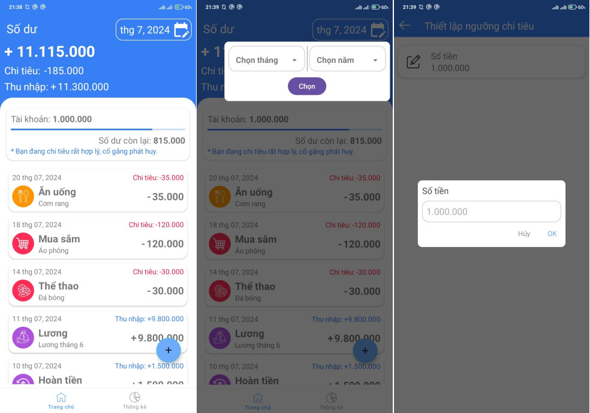
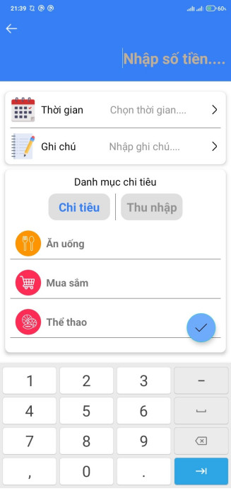
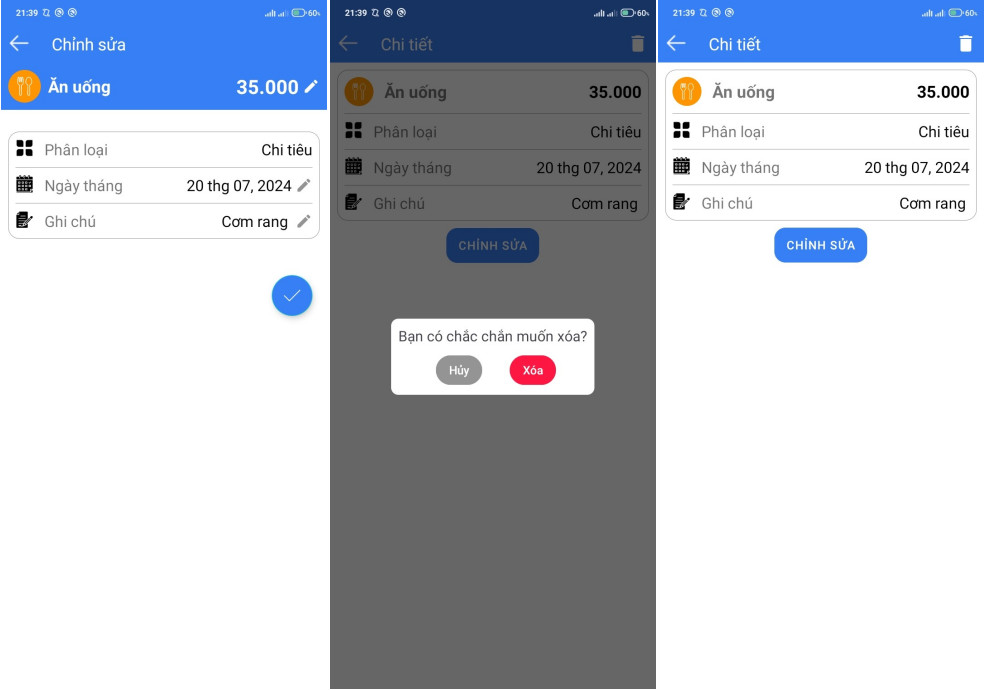
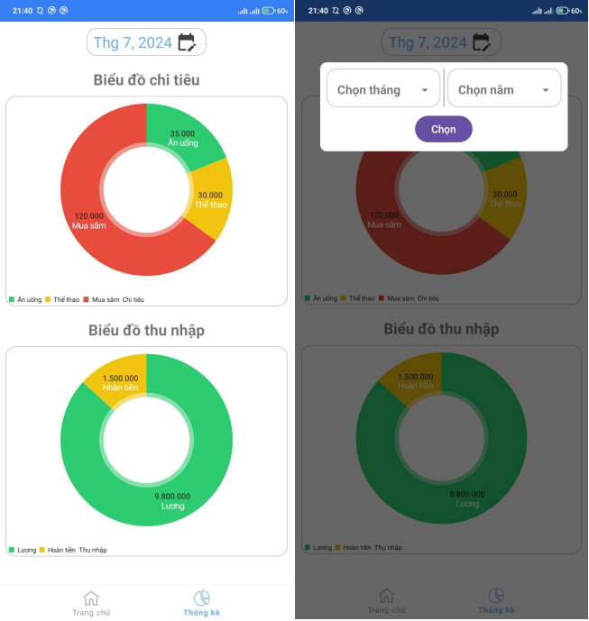

# Ứng dụng Quản lý Chi tiêu

Nếu như bạn cảm thấy khó khăn trong việc quản lý những thu chi hằng ngày thì ứng dụng này dành cho bạn. Với các chức năng ghi chú và thống kê những chi tiêu/ thu nhập của bạn trong từng tháng, ứng dụng sẽ giúp bạn quản lý đồng tiền một cách tường minh và hợp lý hơn. Bằng cách sử dụng bộ nhớ điện thoại để lưu trữ dữ liệu với SQLite, bạn không cần phải sử dụng đến internet để quản lý thu chi của mình. Sau đây là những chức năng chính của ứng dụng:

## Chức năng chính

### Thống kê những chi tiêu/ thu nhập trong tháng
- Cho phép bạn xem những gì đã mua/ đã thu về trong tháng qua dưới dạng danh sách.
- Hiển thị số tiền đã chi tiêu, thu nhập và tổng số thu chi trong tháng đó.
- Xem lại lịch sử chi tiêu của những tháng trước đó để so sánh với hiện tại.
- Đặt mức chi tiêu cho bản thân để sử dụng tiền hợp lý.

### Thêm chi tiêu/ thu nhập
- Dễ dàng thêm vào những chi tiêu cá nhân trong tháng với giao diện đơn giản và gần gũi.

### Chỉnh sửa và xóa
- Chỉnh sửa lại thông tin chi tiêu/thu nhập khi nhập sai.
- Xóa bỏ các mục chi tiêu không cần thiết.

### Biểu đồ thống kê
- Sử dụng biểu đồ tròn để thống kê chi tiêu và thu nhập trong tháng bất kì, giúp dễ dàng so sánh thu chi trong tháng đó.

